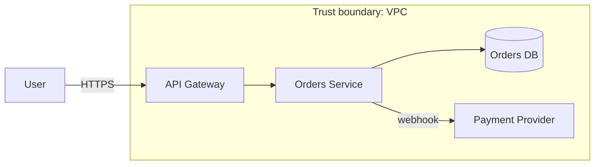

# Threat Modeling

Ask four questions (Shostack): **What are we building? What can go wrong? What will we do about it? Did we do a good job?** Run it per feature/epic in 60–90 minutes with dev, QA, security and product.

## Step 1 — Model the system (data-flow diagram)
Draw external entities, processes, data stores, data flows and **trust boundaries** (internet↔DMZ, tenant↔tenant, service↔service, user↔admin, prod↔CI). Every flow that crosses a boundary deserves scrutiny. Tools: OWASP Threat Dragon, Microsoft Threat Modeling Tool, Mermaid/draw.io, `pytm`.



## Step 2 — Enumerate threats with STRIDE
| | Threat | Property | Example control to verify |
| :-: | :--- | :--- | :--- |
| S | Spoofing | Authentication | Signed webhooks, token validation |
| T | Tampering | Integrity | Server-side price/ID checks, message signing |
| R | Repudiation | Non-repudiation | Audit trail for sensitive actions |
| I | Information disclosure | Confidentiality | Object-level authorization, generic errors, log hygiene |
| D | Denial of service | Availability | Rate limits, payload caps, timeouts |
| E | Elevation of privilege | Authorization | Deny-by-default, role checks in the data layer |
Privacy: **LINDDUN** (Linkability, Identifiability, Non-repudiation, Detectability, Disclosure, Unawareness, Non-compliance). Also write **abuse cases** ("As a malicious user I want to redeem a one-time coupon repeatedly") next to user stories.

## Step 3 — Rate and decide
Risk = likelihood × impact (1–5 each). Decide per threat: **mitigate, eliminate, transfer, or accept** (with owner and expiry). Prefer design-level fixes: least privilege, allow-list validation, idempotency, defense in depth.

## Step 4 — Turn threats into tests (the QA payoff)
```
Threat T-07: a valid payment webhook is replayed to credit an order twice.
Mitigation:  HMAC signature + timestamp tolerance + event-ID de-duplication.
Tests: unsigned → rejected · bad signature → rejected · stale timestamp → rejected
       same event twice → credited once · tampered amount → signature failure
Layer: API integration (+ event-driven-messaging-testing)    Status: automated
```
Keep a **threat → mitigation → test → status** table in the repo and review it when the architecture changes.

## Re-model when
New integration, new data class (PII/payment), auth change, new tenancy model, public API, infra move, major dependency.

## Pitfalls
One-off workshop then shelved · no trust boundaries drawn · only external attackers considered (forget insiders, CI/CD, supply chain) · threats with no owner or test · diagrams too detailed to review.

## Related
`security-testing`, `authn-authz-testing`, `requirements-testing-review`, `compliance-testing`, `security-owasp`
